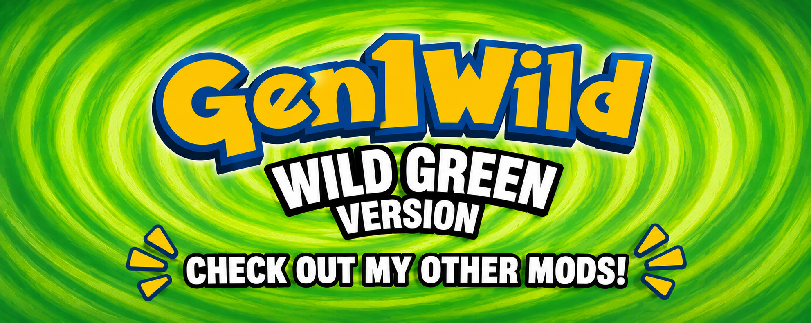
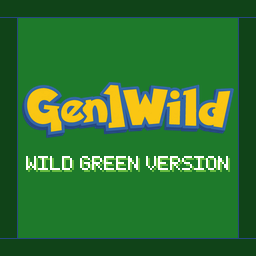

<p align="center">
  <a href="https://wild1walker.github.io/Gen1Wild/"></a>
</p>

# Wild Green

**This is, I think, the definitive way to play Red.**

Every quality-of-life and visual upgrade in the [Gen1Wild][index] suite, in
one cart — and only the ones that still feel like Red. That was the whole
filter. Sprinting, autosave, a Pokédex worth opening, a bag with pockets,
battle backdrops, animated Crystal sprites, a Pokémon walking behind you: none
of it turns this into a different game. It is the game you remember, with the
parts that made you put it down taken out.

**And you can catch every single one of them.** All 151, in one save, on one
version, without trading — the legendaries retryable until you land them, the
trade evolutions handled by an item, Mew waiting behind the Mansion journals
where it always should have been. Every encounter the cartridge already had
still behaves exactly as it always did.

So if you are going for a 100% Kanto dex, or you just want Red to feel like a
game made this decade, Wild Green is the most enjoyable way to do it.

## It is a version, not a mod list

Wild Green is a [custom cart][carts] for [gen1recomp][engine]: a fixed set of
mods that plays as its own game, with its own entry in the launcher, its own
cartridge and label, and its own save slots. Nothing here writes into your
base Red saves. Two people running Wild Green are running the same game.

| | Pinned | What it is |
|---|---|---|
|  | **[Gen1WildQOL][qol]** | Everything that makes Red *play* better: sprinting, autosave, auto continue, sound, followers, all 151, EXP share, the move reminder, menu layout, the mod manager and four later-generation conveniences. |
|  | **[Gen1WildUI][ui]** | Everything that makes Red *look* better: battle backdrops, the battle intro and menus, the Pokédex, the box, the party menu, the bag, item icons and descriptions, the lift panel. |
| | **[Crystal Animated Sprites with Shiny Visuals][crystal]** | Crystal animated battle sprites, Gen 2-style shiny reveals, and swappable trainer portraits. Somebody else's mod, pinned as it is. |
| | **[Wild Green][mod]** | The version itself: the player in green wherever the game draws him, and `WILD GREEN VERSION` on the title screen. Written for this cart. |

The mod set is sealed — you cannot add to it — but every one of the four can
still be switched off, and every feature inside them is still a switch you can
flip. A cart you could not play your own way would miss the point.

The green is derived from Red's own art rather than shipped, so switching back
to `PLAYER = RED` gives you the original character with nothing to reinstall.

The base game is **Red**. The cart carries no game data and no ROM bytes; you
bring your own, exactly as the engine already asks.

## Installing it

Download `wild_green-<version>.g1rcart` from
[Releases](https://github.com/wild1walker/Gen1WildGreen/releases) and open it
from the game — **Custom Carts > Import a cart** on desktop, or drop the file
into the `carts` folder of your save directory and the launcher picks it up.

If a pinned mod is missing, the cart's own page offers **Install required
mods** and fetches them for you. Reach for that rather than breaking the seal.

## Credits

- **[Gen1Wild][index]** — the suite this is the version of, and the wordmark
  on the label.
- **distilledorion-sketch** — [Crystal Animated Sprites with Shiny
  Visuals][crystal], pinned here unmodified rather than forked.
- **[Gen1Recomp][engine]** — the engine and the cart format.
- **pret** — the disassemblies underneath all of it.

---

## Working on the cart

How the cart is put together, for anyone re-pinning a mod or cutting a
release.

### What is in here

```
cart.json                     identity, base game, seal, one pin per mod
label.png                     the label the launcher draws     (generated)
art/wild_green_label.png      the cartridge artwork, as committed
art/banner.png                the README's banner; links to the index
tools/palette.py              every colour, twinned with the mod's copy
tools/make_label.py           draws label.png
tools/check.py                cart.json agrees; the label is current
```

Exact pinned versions live in [`cart.json`](cart.json) and nowhere else — a
second copy is a copy that goes stale. The cart ships no code; the mod that
gives it its name lives in [its own repository][mod], because a mod release
and a cart release cannot share one repo's tag namespace.

### The green, and the label

[`tools/palette.py`](tools/palette.py) is where every colour is written down,
and the same file is carried in [the mod's repo][mod]. The cartridge shell and
the title screen's lettering are the same number rather than two greens
matched by eye — `tools/check.py` fails if `cart.json` and the palette ever
disagree, and `--online` fails if this repo's palette has drifted from the
mod's.

<p align="center">
  
</p>

The label is [`art/wild_green_label.png`](art/wild_green_label.png) scaled to
256×256 by [`tools/make_label.py`](tools/make_label.py). The same file is the
cart's card in the [Gen1Wild][index] index, so the cartridge and the card are
one picture rather than two kept alike by hand.

### Working on it

```sh
python3 tools/check.py             # the cart's own gate
python3 tools/check.py --online    # ...and the palette against the mod's
```

Everything else is `tools/cartkit.py` from a [gen1recomp][engine] checkout,
pointed at this directory — `validate`, `validate --online`, `pack`. To re-pin
a mod when it cuts a release:

```sh
python3 /path/to/gen1recomp/tools/cartkit.py pin . \
  wild1walker/Gen1MakeItGreen@1.20.0 --id wild_green
```

`--id` is not optional: cartkit derives a pin id from the repository name,
which gives `gen1makeitgreen`, and the loader matches the manifest's
`wild_green`.

**Never hand-edit a version string in `cart.json`.** The `gen1_wild_ui` pin
once spent six versions reading a version that repo never released, because a
script matched the first `"version"` under `mods` and rewrote the wrong entry.
`cartkit pin` addresses the entry by id.

### Releasing

**Bump `"version"` in `cart.json` and push to `main`. That is all of it.**

[`.github/workflows/cart-release.yml`](.github/workflows/cart-release.yml)
validates every pin against the real releases, packs the cart, tags it, and
publishes the `.g1rcart` with a `sha256sums.txt`. Nothing is tagged before
validation passes, so a cart pointing at an unpublished mod fails the run
rather than leaving a stray tag behind.

The [Gen1Wild][index] index rebuilds hourly, reads the pins out of this
repo's `cart.json` and re-fetches `label.png`, so nothing there needs touching
when this releases.

## Licence

MIT. See [LICENSE](LICENSE).

[engine]: https://github.com/bryanthaboi/gen1recomp
[carts]: https://github.com/bryanthaboi/gen1recomp/wiki/Guide-Custom-Carts
[index]: https://github.com/wild1walker/Gen1Wild
[ui]: https://github.com/wild1walker/Gen1WildUI
[qol]: https://github.com/wild1walker/Gen1WildQOL
[crystal]: https://github.com/distilledorion-sketch/crystal_animated_sprites_with_shiny_visuals
[mod]: https://github.com/wild1walker/Gen1MakeItGreen
